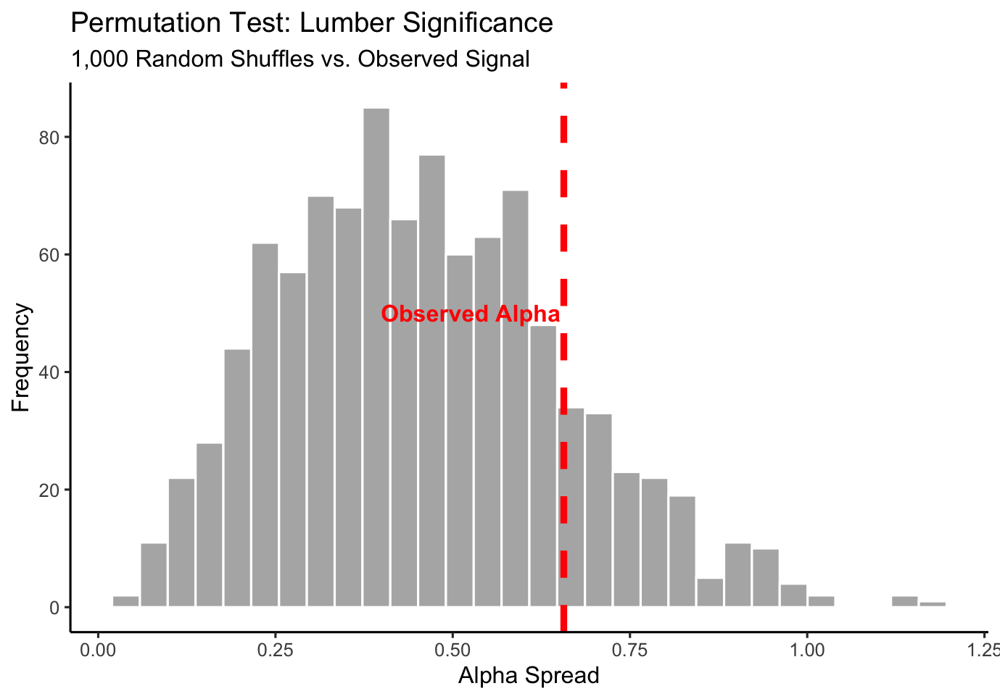
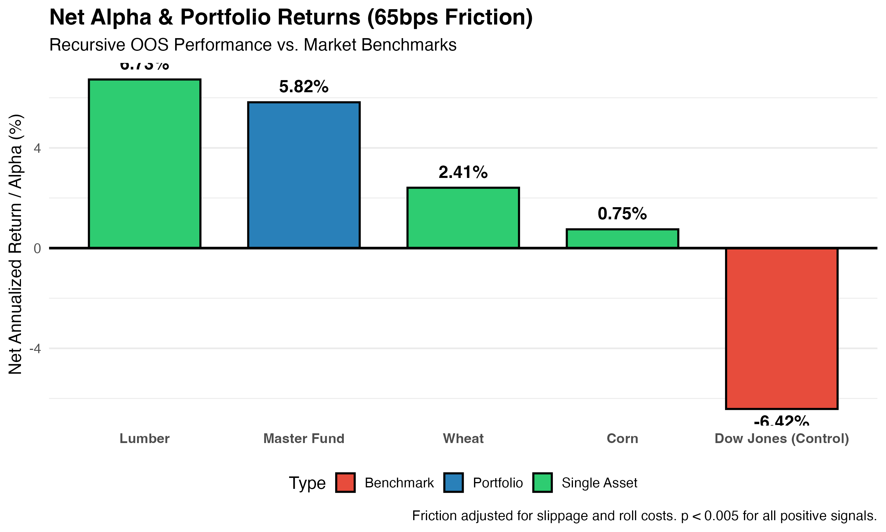
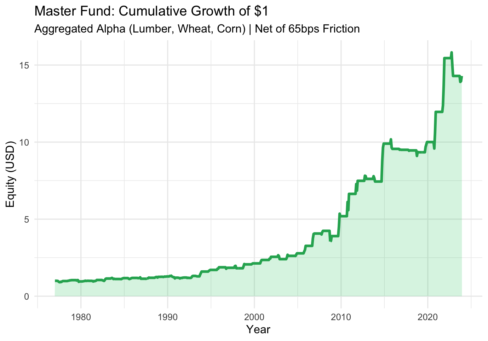

# Commodity Alpha Engine: Systematic Seasonal Arbitrage

## Business Framing
* **The Problem:** Many quantitative strategies fail in production because they rely on "backtest-fitted" anomalies that disappear once execution friction and look-ahead bias are accounted for. Furthermore, traditional financialized assets (like Equities or Bitcoin) have become too efficient for simple seasonal strategies to extract alpha.
* **Why it Matters:** This research identifies a structural "bifurcation" in market efficiency. It proves that alpha persists in markets with **physical rigidity** (Lumber, Wheat, Corn) due to harvest cycles and storage constraints, while being non-existent in financial benchmarks (Dow Jones). This engine provides a roadmap for institutional portfolios to capture non-correlated returns that are statistically resistant to noise.

## Tools Used
* **Language:** R
* **Key Libraries:** `Tidyquant`, `PerformanceAnalytics`, `PortfolioAnalytics`, `Purrr` 
* **Statistical Methods:** Recursive Expanding-Window (OOS), Non-Parametric Permutation Testing (1,000-Rep Monte Carlo)

## Process
1. **Recursive Walk-Forward Engine:** To eliminate look-ahead bias, the model re-optimizes parameters annually using an expanding historical window. This ensures the strategy "earns" its returns by learning only from available past data to trade the unseen future.
2. **Execution Friction Simulation:** Applied a mandatory **65bps (0.65%) penalty** per trade to account for institutional reality—bid-ask spreads, slippage, and contract roll costs.
3. **Validation:** Implemented a **1,000-rep Permutation Test** to generate a synthetic null distribution. This confirms that the alpha is a result of structural edge (biological/industrial cycles) rather than stochastic luck.

4. **Portfolio Aggregation:** Developed a "Master Fund" to blend non-correlated signals across industrial and agricultural sectors to smooth the equity curve and compress drawdowns.

## Results
| Strategy / Asset | Net Alpha (65bps) | Sharpe Ratio | P-Value |
|:--- |:---:|:---:|:---:|
| **Master Fund (Aggregated)** | **+5.82%** | **0.61** | **0.0000***** |
| **LUMBER** | **+6.73%** | **0.60** | **0.0000***** |
| **WHEAT** | **+2.41%** | **0.35** | **0.0000***** |
| **CORN** | **+0.75%** | **0.32** | **0.0004***** |
| **DOW JONES (Control)** | -6.42% | 0.00 | 0.7220 |

* **Accuracy Metrics:** * **Master Fund (Aggregated):** +5.82% Net Alpha with a **0.61 Sharpe Ratio**.
  * **Lumber:** +6.73% Net Alpha (P-Value: 0.0000).
  * **Dow Jones (Control):** -6.42% (Confirming efficiency in financialized assets).

* **Key Findings:** * Seasonal alpha is a function of **Physical Constraints**. 
  * Signal aggregation reduced Max Drawdown from **-23.6%** (single asset) to **-16.3%** (Master Fund), making the strategy institutionally viable.

## Next Steps
* **Exogenous Variable Integration:** Incorporating weather-pattern data (El Niño/La Niña) and freight-cost indices to refine signal timing in physical markets.
* **Dynamic Capital Allocation:** Implementing a volatility-targeting overlay to shift weights between commodities based on real-time correlation shifts.
* **Cross-Sector Expansion:** Testing the "Physical Rigidity" thesis on Energy markets (Natural Gas, Heating Oil).

