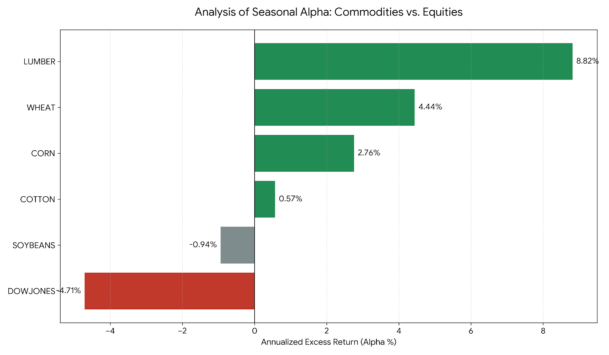

# Commodity Alpha Engine: Recursive Seasonal Backtesting

This repository contains a quantitative framework designed to identify and validate structural seasonal alpha across physical and financial asset classes.

## 📊 Performance Summary
The model identifies a clear bifurcation in market efficiency. Seasonal alpha persists in markets with rigid physical supply constraints, while benchmark equities remain seasonally efficient.

 

### Key Statistics
| Asset | Annualized Alpha | Sharpe (WF) | P-Value |
| :--- | :--- | :--- | :--- |
| **LUMBER** | **+8.82%** | **0.70** | **0.000** |
| **WHEAT** | **+4.44%** | **0.47** | **0.000** |
| **CORN** | **+2.76%** | **0.48** | **0.000** |
| **DOW JONES** | **-4.71%** | 0.17 | 0.749 |

## 🛠 Methodology
To ensure institutional-grade robustness, the engine utilizes:
1. **Recursive Walk-Forward Optimization:** Simulates real-time decision-making by re-optimizing the strategy annually using only expanding historical data.
2. **Permutation Significance Testing:** 2,000 shuffles per asset to ensure the observed alpha is not the result of stochastic noise.
3. **Data Pipeline:** Automated cleaning and standardization of disparate datasets from FRED and Macrotrends.

## 📈 Strategic Thesis
The persistence of alpha in physical commodities is driven by non-arbitrable constraints, including biological growth cycles, harvest timelines, and high storage/carry costs that prevent traditional financial arbitrage.

---
**Contact:** [Alexander Laudano] | [https://www.linkedin.com/in/alexander-laudano-874073259/]
